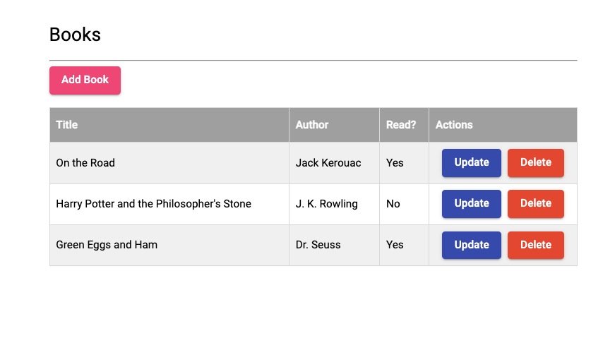
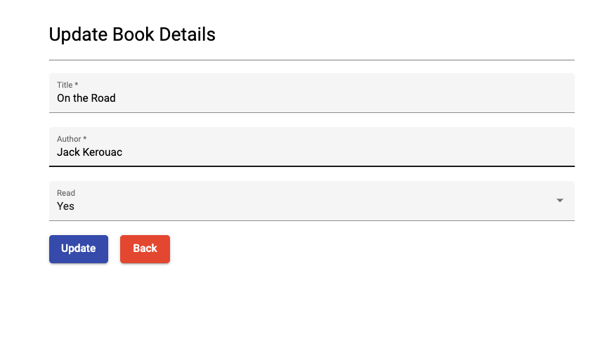
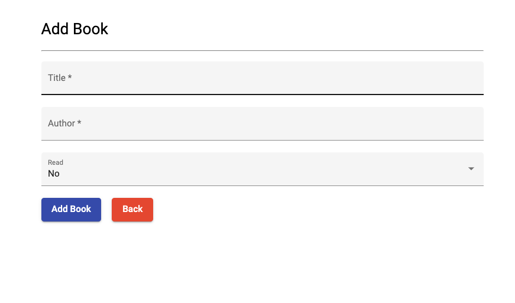
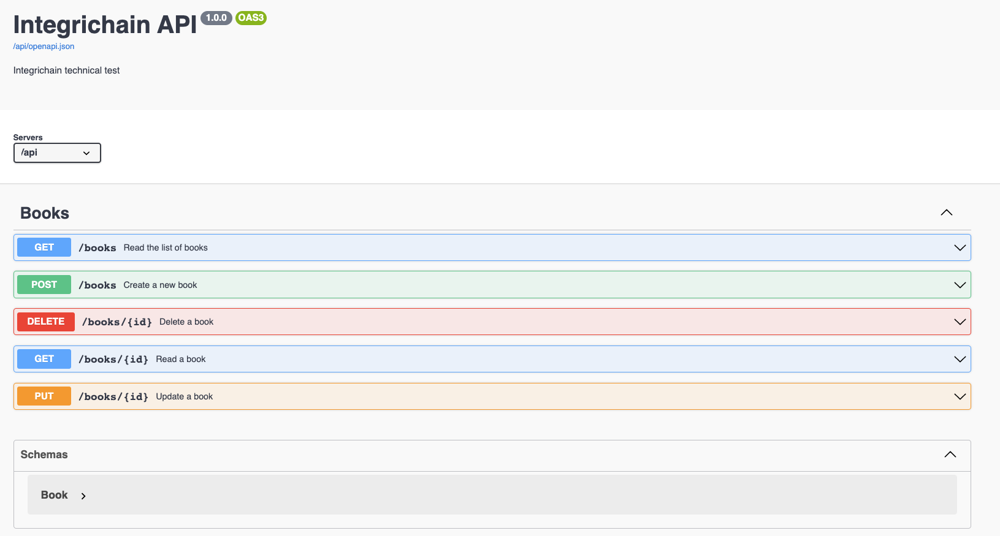

# Setup Instructions

## Table of Contents

1. [Run the App with Docker](#run-the-app-with-docker)
2. [Run the App Locally](#run-the-app-locally)
3. [Backend](#backend)
4. [Frontend](#frontend)
5. [Swagger](#swagger)
6. [Icebox](#icebox)

## Run the App with Docker

Make sure you have the Docker app open. If you don't have Docker installed, you can download it [here](https://www.docker.com/products/docker-desktop).
Use the following command to start the Docker containers:
```console
$ docker-compose up
```

## Run the App Locally
If you don't want to use Docker, you can follow the instructions below to run the app locally.

## Prerequisites

Make sure you have the following installed on your machine:

1. Python3.9.6 (https://www.python.org/downloads/)
2. Angular CLI: 14.2.10 (https://angular.io/cli)

## Backend

### Setup and Activate Virtual Environment

Navigate to the backend folder and run the following command:
```console
$ python -m venv venv
```

Activate the virtual environment using the following command on Mac/Linux:
```console
$ source venv/bin/activate
```

### Install Dependencies

Navigate to the backend folder and install the dependencies using the following command:
```console
$ pip install -r requirements.txt
```

### Run the Server

Navigate to the backend folder and run the following command:
```console
$ python app.py
```

Server will be running on http://localhost:5000

## Frontend

### Install Dependencies

Navigate to the frontend folder and install the dependencies using the following command:
```console
$ npm install
```

### Run the Server

Navigate to the frontend folder and run the following command:
```console
$ ng serve --open
```

#### Books List Page


#### Book Update Page


#### Book Add Page



Server will be running on http://localhost:4200

## Swagger

To view the Swagger documentation, navigate to http://localhost:5000/api/ui



## Icebox
1. Implement integration tests(pytest or unittest)
2. Create Postman test scenarios to run a regression test on every endpoint

